# Workflow de la commande Setup

Ce diagramme illustre le workflow principal de la commande setup pour AIBlueprint CLI.

```mermaid
flowchart TD
    Start([L'utilisateur exécute: aiblueprint claude-code setup]) --> CheckSkip{Flag --skip ?}

    CheckSkip -->|Non| Interactive[Sélection interactive des fonctionnalités]
    CheckSkip -->|Oui| AllFeatures[Sélectionner toutes les fonctionnalités]

    Interactive --> Features{Fonctionnalités<br/>sélectionnées}
    AllFeatures --> Features

    Features --> GitHub{Vérifier la<br/>connectivité GitHub}

    GitHub -->|Disponible| DownloadGH[Télécharger depuis GitHub<br/>raw.githubusercontent.com]
    GitHub -->|Indisponible| LocalFallback[Utiliser le dossier local<br/>claude-code-config/]

    DownloadGH --> InstallProcess
    LocalFallback --> InstallProcess

    InstallProcess[Processus d'installation] --> ShellShortcuts{Raccourcis Shell<br/>sélectionnés ?}

    ShellShortcuts -->|Oui| AddAliases[Ajouter les alias cc/ccc à<br/>~/.zshenv ou ~/.bashrc]
    ShellShortcuts -->|Non| CommandValidator

    AddAliases --> CommandValidator{Validation des<br/>commandes sélectionnée ?}

    CommandValidator -->|Oui| InstallValidator[Installer le script command-validator<br/>+ Ajouter le hook PreToolUse]
    CommandValidator -->|Non| CustomStatusline

    InstallValidator --> CustomStatusline{Statusline<br/>personnalisée ?}

    CustomStatusline -->|Oui| InstallStatusline[Installer le script statusline<br/>+ Exécuter bun install<br/>+ Mettre à jour settings.json]
    CustomStatusline -->|Non| Commands

    InstallStatusline --> CheckDeps[Vérifier et installer les dépendances<br/>bun, ccusage]
    CheckDeps --> Commands

    Commands{Commandes AIBlueprint<br/>sélectionnées ?}

    Commands -->|Oui| CopyCommands[Copier 16 templates de commandes<br/>vers ~/.claude/commands/]
    Commands -->|Non| Agents

    CopyCommands --> Agents{Agents AIBlueprint<br/>sélectionnés ?}

    Agents -->|Oui| CopyAgents[Copier 3 templates d'agents<br/>vers ~/.claude/agents/]
    Agents -->|Non| Sounds

    CopyAgents --> Sounds{Sons de notification<br/>sélectionnés ?}

    Sounds -->|Oui| InstallSounds[Installer les fichiers MP3<br/>+ Ajouter les hooks Stop/Notification]
    Sounds -->|Non| PostEdit

    InstallSounds --> PostEdit{Hook Post-Edit TS<br/>sélectionné ?}

    PostEdit -->|Oui| InstallPostEdit[Installer le script hook-post-file<br/>+ Ajouter le hook PostToolUse]
    PostEdit -->|Non| Symlinks

    InstallPostEdit --> Symlinks{Liens symboliques<br/>Codex/OpenCode ?}

    Symlinks -->|Oui| CreateSymlinks[Créer les symlinks pour<br/>commandes/agents]
    Symlinks -->|Non| UpdateSettings

    CreateSymlinks --> UpdateSettings[Mettre à jour ~/.claude/settings.json<br/>Fusionner toutes les configurations]

    UpdateSettings --> Success([✅ Setup terminé<br/>Afficher le rapport de succès])

    style Start fill:#e1f5ff
    style Success fill:#d4edda
    style GitHub fill:#fff3cd
    style DownloadGH fill:#cfe2ff
    style LocalFallback fill:#f8d7da
```

## Points clés

1. **Sélection des fonctionnalités** : Invites interactives (ou `--skip` pour tout sélectionner)
2. **Priorité des sources** : GitHub en premier, repli local en cas d'échec
3. **Installation conditionnelle** : Chaque fonctionnalité n'est installée que si elle est sélectionnée
4. **Fusion des paramètres** : Toutes les configurations sont fusionnées dans le `settings.json` existant
5. **Vérification des dépendances** : Installe automatiquement `bun` et `ccusage` si nécessaire

## Fichiers associés

- Source : `src/commands/setup.ts`
- Gestionnaire de paramètres : `src/commands/setup/settings.ts`
- Utilitaires GitHub : `src/utils/github.ts`
- Installateur de fichiers : `src/utils/file-installer.ts`
