# Setup Command Workflow

This diagram illustrates the main setup command workflow for AIBlueprint CLI.

```mermaid
flowchart TD
    Start([User runs: aiblueprint claude-code setup]) --> CheckSkip{--skip flag?}

    CheckSkip -->|No| Interactive[Interactive Feature Selection]
    CheckSkip -->|Yes| AllFeatures[Select All Features]

    Interactive --> Features{Selected Features}
    AllFeatures --> Features

    Features --> GitHub{Check GitHub<br/>Connectivity}

    GitHub -->|Available| DownloadGH[Download Latest from GitHub<br/>raw.githubusercontent.com]
    GitHub -->|Unavailable| LocalFallback[Use Local claude-code-config/]

    DownloadGH --> InstallProcess
    LocalFallback --> InstallProcess

    InstallProcess[Installation Process] --> ShellShortcuts{Shell Shortcuts<br/>Selected?}

    ShellShortcuts -->|Yes| AddAliases[Add cc/ccc aliases to<br/>~/.zshenv or ~/.bashrc]
    ShellShortcuts -->|No| CommandValidator

    AddAliases --> CommandValidator{Command Validation<br/>Selected?}

    CommandValidator -->|Yes| InstallValidator[Install command-validator script<br/>+ Add PreToolUse hook]
    CommandValidator -->|No| CustomStatusline

    InstallValidator --> CustomStatusline{Custom Statusline<br/>Selected?}

    CustomStatusline -->|Yes| InstallStatusline[Install statusline script<br/>+ Run bun install<br/>+ Update settings.json]
    CustomStatusline -->|No| Commands

    InstallStatusline --> CheckDeps[Check & Install Dependencies<br/>bun, ccusage]
    CheckDeps --> Commands

    Commands{AIBlueprint Commands<br/>Selected?}

    Commands -->|Yes| CopyCommands[Copy 16 command templates<br/>to ~/.claude/commands/]
    Commands -->|No| Agents

    CopyCommands --> Agents{AIBlueprint Agents<br/>Selected?}

    Agents -->|Yes| CopyAgents[Copy 3 agent templates<br/>to ~/.claude/agents/]
    Agents -->|No| Sounds

    CopyAgents --> Sounds{Notification Sounds<br/>Selected?}

    Sounds -->|Yes| InstallSounds[Install MP3 files<br/>+ Add Stop/Notification hooks]
    Sounds -->|No| PostEdit

    InstallSounds --> PostEdit{Post-Edit TS Hook<br/>Selected?}

    PostEdit -->|Yes| InstallPostEdit[Install hook-post-file script<br/>+ Add PostToolUse hook]
    PostEdit -->|No| Symlinks

    InstallPostEdit --> Symlinks{Codex/OpenCode<br/>Symlinks?}

    Symlinks -->|Yes| CreateSymlinks[Create symlinks for<br/>commands/agents]
    Symlinks -->|No| UpdateSettings

    CreateSymlinks --> UpdateSettings[Update ~/.claude/settings.json<br/>Merge all configurations]

    UpdateSettings --> Success([✅ Setup Complete<br/>Show Success Report])

    style Start fill:#e1f5ff
    style Success fill:#d4edda
    style GitHub fill:#fff3cd
    style DownloadGH fill:#cfe2ff
    style LocalFallback fill:#f8d7da
```

## Key Points

1. **Feature Selection**: Interactive prompts (or `--skip` for all)
2. **Source Priority**: GitHub first, local fallback
3. **Conditional Installation**: Each feature is installed only if selected
4. **Settings Merge**: All configurations are merged into existing `settings.json`
5. **Dependency Check**: Automatically installs `bun` and `ccusage` if needed

## Related Files

- Source: `src/commands/setup.ts`
- Settings Handler: `src/commands/setup/settings.ts`
- GitHub Utils: `src/utils/github.ts`
- File Installer: `src/utils/file-installer.ts`
