# Workflow d'ajout de Hook

Ce diagramme illustre le workflow de la commande d'ajout de hook pour installer des hooks Claude Code.

```mermaid
flowchart TD
    Start([L'utilisateur exécute: aiblueprint claude-code add hook &lt;type&gt;]) --> ValidateType{Type de Hook valide?<br/>post-edit-typescript}

    ValidateType -->|Non| Error1([❌ Erreur: Type de hook non supporté])
    ValidateType -->|Oui| DetermineTarget{Déterminer le répertoire<br/>cible}

    DetermineTarget --> InProject{Dans un projet Git<br/>avec .claude/?}

    InProject -->|Oui| UseProject[Cible: .claude/ à la racine du projet<br/>Utilise $CLAUDE_PROJECT_DIR]
    InProject -->|Non| UseGlobal[Cible: ~/.claude/<br/>Configuration globale]

    UseProject --> CheckExist
    UseGlobal --> CheckExist

    CheckExist{Le fichier de hook<br/>existe déjà?}

    CheckExist -->|Oui| PromptOverwrite{Demander à l'utilisateur:<br/>Écraser l'existant?}
    CheckExist -->|Non| DownloadHook

    PromptOverwrite -->|Non| Cancel([❌ Opération annulée])
    PromptOverwrite -->|Oui| DownloadHook

    DownloadHook[Télécharger le Hook] --> GHCheck{GitHub<br/>disponible?}

    GHCheck -->|Oui| DownloadGH[Télécharger depuis GitHub<br/>raw.githubusercontent.com]
    GHCheck -->|Non| UseLocal[Utiliser les fichiers locaux<br/>claude-code-config/]

    DownloadGH --> WriteFile[Écrire le fichier de hook dans la cible]
    UseLocal --> WriteFile

    WriteFile --> MakeExecutable[chmod 755<br/>Rendre le hook exécutable]

    MakeExecutable --> UpdateSettings[Mettre à jour settings.json<br/>Ajouter la configuration du hook]

    UpdateSettings --> HookConfig[Configuration du Hook:<br/>- Event: PostToolUse<br/>- Matcher: Edit&#124;Write&#124;MultiEdit<br/>- File Pattern: *.ts, *.tsx<br/>- Actions: Prettier, ESLint, TypeScript]

    HookConfig --> Success([✅ Hook installé avec succès<br/>Le hook est maintenant actif])

    style Start fill:#e1f5ff
    style Success fill:#d4edda
    style Error1 fill:#f8d7da
    style Cancel fill:#f8d7da
    style HookConfig fill:#d1ecf1
    style MakeExecutable fill:#fff3cd
```

## Détails du Hook: post-edit-typescript

**Objectif**: Formater et valider automatiquement les fichiers TypeScript après édition

**Configuration**:
- **Event**: `PostToolUse`
- **Matcher**: `Edit|Write|MultiEdit`
- **File Pattern**: `*.ts`, `*.tsx`
- **Actions**:
  1. Exécute Prettier pour le formatage
  2. Exécute ESLint pour le linting
  3. Exécute le compilateur TypeScript pour la vérification de types
  4. Rapporte les erreurs s'il y en a

**Variables d'environnement**:
- `$CLAUDE_PROJECT_DIR`: Pointe vers la racine du projet (assure la portabilité)

## Hooks supportés

Actuellement supporté:
- `post-edit-typescript`: Validation TypeScript post-édition

Des hooks futurs peuvent être ajoutés en:
1. Créant un script de hook dans `claude-code-config/scripts/hooks/`
2. Ajoutant à la liste des hooks supportés dans `src/commands/addHook.ts`

## Fichiers associés

- Source: `src/commands/addHook.ts`
- Script de Hook: `claude-code-config/scripts/hooks/hook-post-file`
- Gestionnaire de paramètres: `src/commands/setup/settings.ts`
