# Add Hook Command Workflow

This diagram illustrates the add hook command workflow for installing Claude Code hooks.

```mermaid
flowchart TD
    Start([User runs: aiblueprint claude-code add hook &lt;type&gt;]) --> ValidateType{Valid Hook Type?<br/>post-edit-typescript}

    ValidateType -->|No| Error1([❌ Error: Unsupported hook type])
    ValidateType -->|Yes| DetermineTarget{Determine Target<br/>Directory}

    DetermineTarget --> InProject{In Git Project<br/>with .claude/?}

    InProject -->|Yes| UseProject[Target: .claude/ in project root<br/>Use $CLAUDE_PROJECT_DIR]
    InProject -->|No| UseGlobal[Target: ~/.claude/<br/>Global configuration]

    UseProject --> CheckExist
    UseGlobal --> CheckExist

    CheckExist{Hook File<br/>Already Exists?}

    CheckExist -->|Yes| PromptOverwrite{Prompt User:<br/>Overwrite existing?}
    CheckExist -->|No| DownloadHook

    PromptOverwrite -->|No| Cancel([❌ Operation Cancelled])
    PromptOverwrite -->|Yes| DownloadHook

    DownloadHook[Download Hook] --> GHCheck{GitHub<br/>Available?}

    GHCheck -->|Yes| DownloadGH[Download from GitHub<br/>raw.githubusercontent.com]
    GHCheck -->|No| UseLocal[Use Local<br/>claude-code-config/]

    DownloadGH --> WriteFile[Write Hook File to Target]
    UseLocal --> WriteFile

    WriteFile --> MakeExecutable[chmod 755<br/>Make hook executable]

    MakeExecutable --> UpdateSettings[Update settings.json<br/>Add hook configuration]

    UpdateSettings --> HookConfig[Hook Configuration:<br/>- Event: PostToolUse<br/>- Matcher: Edit&#124;Write&#124;MultiEdit<br/>- File Pattern: *.ts, *.tsx<br/>- Actions: Prettier, ESLint, TypeScript]

    HookConfig --> Success([✅ Hook Installed Successfully<br/>Hook is now active])

    style Start fill:#e1f5ff
    style Success fill:#d4edda
    style Error1 fill:#f8d7da
    style Cancel fill:#f8d7da
    style HookConfig fill:#d1ecf1
    style MakeExecutable fill:#fff3cd
```

## Hook Details: post-edit-typescript

**Purpose**: Automatically format and validate TypeScript files after editing

**Configuration**:
- **Event**: `PostToolUse`
- **Matcher**: `Edit|Write|MultiEdit`
- **File Pattern**: `*.ts`, `*.tsx`
- **Actions**:
  1. Runs Prettier for formatting
  2. Runs ESLint for linting
  3. Runs TypeScript compiler for type checking
  4. Reports errors if any

**Environment Variables**:
- `$CLAUDE_PROJECT_DIR`: Points to project root (ensures portability)

## Supported Hooks

Currently supported:
- `post-edit-typescript`: Post-editing TypeScript validation

Future hooks can be added by:
1. Creating hook script in `claude-code-config/scripts/hooks/`
2. Adding to supported hooks list in `src/commands/addHook.ts`

## Related Files

- Source: `src/commands/addHook.ts`
- Hook Script: `claude-code-config/scripts/hooks/hook-post-file`
- Settings Handler: `src/commands/setup/settings.ts`
