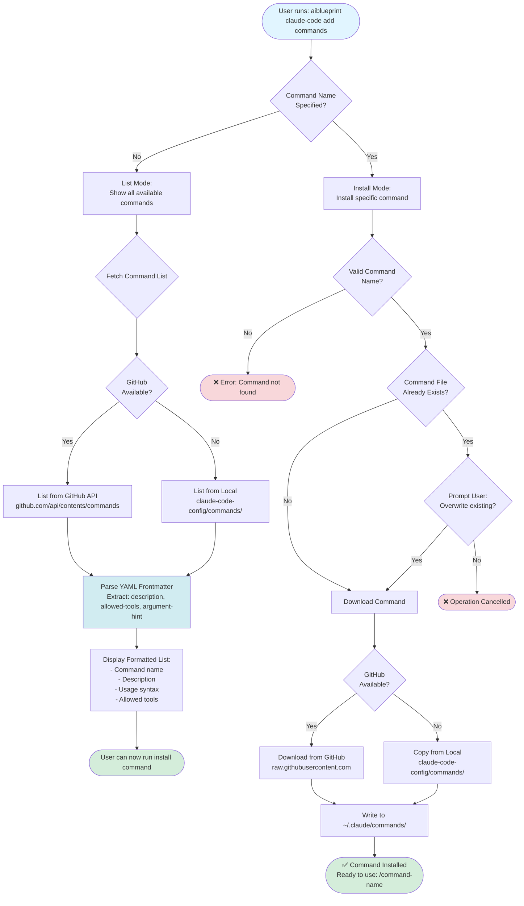

# Add Command Workflow

This diagram illustrates the add command workflow for installing individual Claude Code commands.



## Available Commands (16 templates)

### Development Workflow
- `/commit` - Quick conventional commits with auto-push
- `/create-pull-request` - Create PR with summary and test plan
- `/fix-pr-comments` - Address PR review comments
- `/run-tasks` - Execute project tasks efficiently

### Code Analysis
- `/deep-code-analysis` - Comprehensive code review
- `/explain-architecture` - Document system architecture

### Project Management
- `/claude-memory` - Manage Claude's project memory
- `/cleanup-context` - Clean up conversation context

### Utilities
- `/epct` - Execute and parallelize complex tasks
- `/prompt-command` - Generate new command templates
- `/prompt-agent` - Generate new agent templates
- `/watch-ci` - Monitor CI/CD pipeline

### And more...

## Command Structure

Each command is a Markdown file with:

```markdown
---
description: "Command description"
allowed-tools: "Bash, Read, Edit"
argument-hint: "<required-arg> [optional-arg]"
---

# Command Instructions

[Detailed instructions for Claude...]
```

## Related Files

- Source: `src/commands/addCommand.ts`
- Commands Directory: `claude-code-config/commands/`
- Utilities: `src/utils/claude-config.ts` (YAML parsing)
