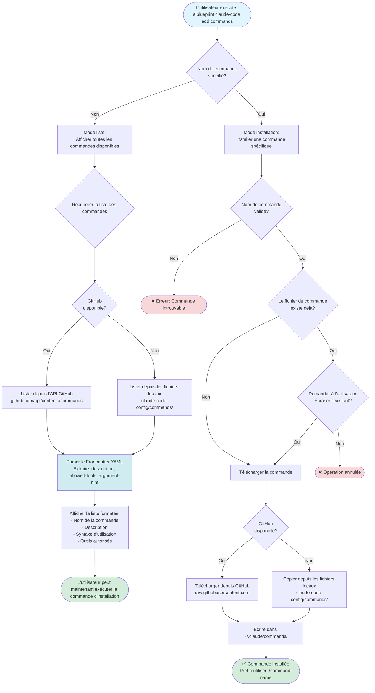

# Workflow d'ajout de commande

Ce diagramme illustre le workflow de la commande d'ajout pour installer des commandes Claude Code individuelles.



## Commandes disponibles (16 templates)

### Workflow de développement
- `/commit` - Commits conventionnels rapides avec auto-push
- `/create-pull-request` - Créer une PR avec résumé et plan de test
- `/fix-pr-comments` - Traiter les commentaires de revue de PR
- `/run-tasks` - Exécuter les tâches du projet efficacement

### Analyse de code
- `/deep-code-analysis` - Revue de code complète
- `/explain-architecture` - Documenter l'architecture du système

### Gestion de projet
- `/claude-memory` - Gérer la mémoire de projet de Claude
- `/cleanup-context` - Nettoyer le contexte de conversation

### Utilitaires
- `/epct` - Exécuter et paralléliser des tâches complexes
- `/prompt-command` - Générer de nouveaux templates de commandes
- `/prompt-agent` - Générer de nouveaux templates d'agents
- `/watch-ci` - Surveiller le pipeline CI/CD

### Et plus encore...

## Structure de commande

Chaque commande est un fichier Markdown avec:

```markdown
---
description: "Description de la commande"
allowed-tools: "Bash, Read, Edit"
argument-hint: "<required-arg> [optional-arg]"
---

# Instructions de la commande

[Instructions détaillées pour Claude...]
```

## Fichiers associés

- Source: `src/commands/addCommand.ts`
- Répertoire des commandes: `claude-code-config/commands/`
- Utilitaires: `src/utils/claude-config.ts` (parsing YAML)
