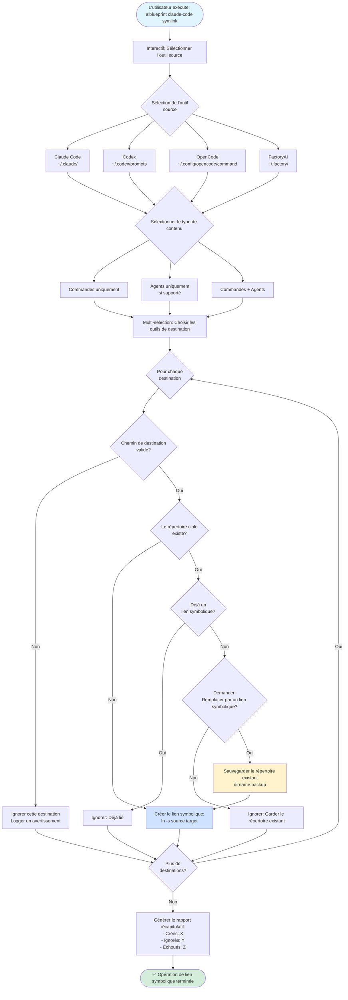

# Workflow de création de liens symboliques

Ce diagramme illustre le workflow de création de liens symboliques pour partager des commandes/agents entre différents outils CLI d'IA.



## Outils supportés

### Options de source et de destination

| Outil | Chemin des commandes | Chemin des agents | Support |
|------|--------------|-------------|---------|
| **Claude Code** | `~/.claude/commands/` | `~/.claude/agents/` | Complet |
| **Codex** | `~/.codex/prompts` | N/A | Commandes uniquement |
| **OpenCode** | `~/.config/opencode/command` | N/A | Commandes uniquement |
| **FactoryAI** | `~/.factory/commands/` | `~/.factory/droids/` | Complet |

## Stratégie de liens symboliques

### Avantages
- **Source unique de vérité**: Mettre à jour les commandes en un seul endroit
- **Compatibilité inter-outils**: Utiliser les mêmes commandes sur différents CLI d'IA
- **Maintenance facile**: Les changements se propagent automatiquement

### Vérifications de sécurité
1. Valide tous les chemins avant de créer des liens symboliques
2. Détecte les répertoires existants non-symboliques
3. Propose une sauvegarde avant le remplacement
4. Ignore les destinations invalides de manière élégante

### Exemple de cas d'usage

Partager les commandes Claude Code avec Codex:
```bash
aiblueprint claude-code symlink
# Sélectionner: Claude Code (source)
# Sélectionner: Commandes
# Sélectionner: Codex (destination)
# Résultat: ~/.codex/prompts -> ~/.claude/commands
```

## Fichiers associés

- Source: `src/commands/symlink.ts`
- Utilitaires de chemins: `src/utils/claude-config.ts`

## Notes importantes

- Les liens symboliques sont bidirectionnels (peuvent synchroniser de n'importe quel outil vers n'importe quel autre)
- Le support des agents dépend des capacités de l'outil
- Des chemins de dossier personnalisés peuvent être spécifiés via les options CLI
