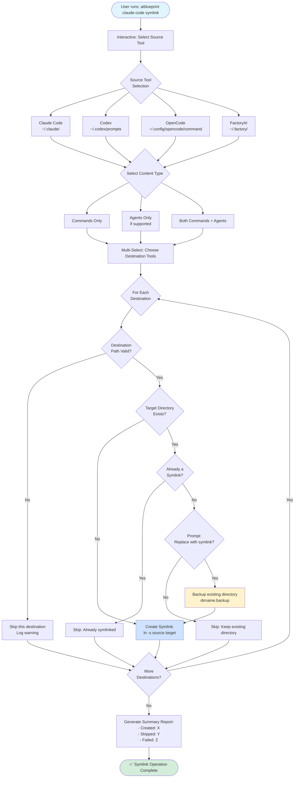

# Symlink Command Workflow

This diagram illustrates the symlink workflow for sharing commands/agents between different AI CLI tools.



## Supported Tools

### Source & Destination Options

| Tool | Commands Path | Agents Path | Support |
|------|--------------|-------------|---------|
| **Claude Code** | `~/.claude/commands/` | `~/.claude/agents/` | Full |
| **Codex** | `~/.codex/prompts` | N/A | Commands Only |
| **OpenCode** | `~/.config/opencode/command` | N/A | Commands Only |
| **FactoryAI** | `~/.factory/commands/` | `~/.factory/droids/` | Full |

## Symlink Strategy

### Benefits
- **Single Source of Truth**: Update commands in one place
- **Cross-Tool Compatibility**: Use same commands across different AI CLIs
- **Easy Maintenance**: Changes propagate automatically

### Safety Checks
1. Validates all paths before creating symlinks
2. Detects existing non-symlink directories
3. Offers backup before replacement
4. Skips invalid destinations gracefully

### Example Use Case

Share Claude Code commands with Codex:
```bash
aiblueprint claude-code symlink
# Select: Claude Code (source)
# Select: Commands
# Select: Codex (destination)
# Result: ~/.codex/prompts -> ~/.claude/commands
```

## Related Files

- Source: `src/commands/symlink.ts`
- Path Utilities: `src/utils/claude-config.ts`

## Important Notes

- Symlinks are bidirectional (can sync from any tool to any other)
- Agent support depends on tool capabilities
- Custom folder paths can be specified via CLI options
