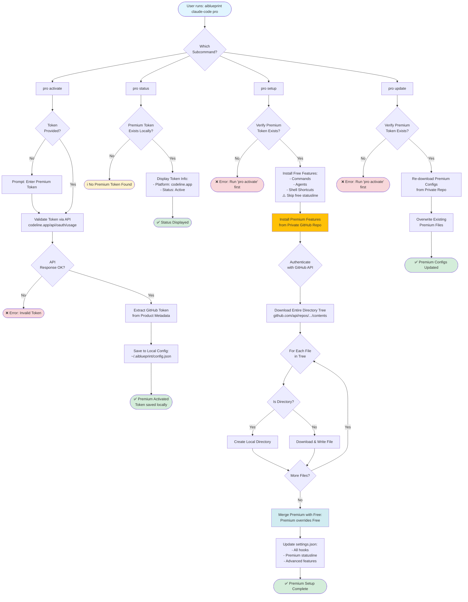

# Pro (Premium) Command Workflow

This diagram illustrates the premium features workflow with token-based authentication.



## Premium Features

### What's Included?

**Premium Commands**:
- Advanced workflow automation
- Enhanced productivity commands
- Exclusive templates

**Premium Agents**:
- Specialized AI agents
- Task-specific optimizations

**Premium Statusline**:
- Advanced metrics
- Enhanced visualizations
- Real-time insights

**Premium Hooks**:
- Additional security layers
- Performance optimizations
- Custom event handlers

### Authentication Flow

1. **Token Validation**: API call to `codeline.app/api/oauth/usage`
2. **GitHub Token Extraction**: From product metadata
3. **Local Storage**: Saved in `~/.aiblueprint/config.json`
4. **API Authentication**: Used for private repo access

### API Integration

**Endpoint**: `https://codeline.app/api/products`

**Authentication**: Bearer token (premium token)

**Response Structure**:
```json
{
  "products": [{
    "metadata": {
      "github_token": "ghp_xxx..."
    }
  }]
}
```

### Premium vs Free

| Feature | Free | Premium |
|---------|------|---------|
| Commands | 16 templates | Extended library |
| Agents | 3 basic | Advanced agents |
| Statusline | Basic | Enhanced metrics |
| GitHub Repo | Public | Private |
| Support | Community | Priority |

## Related Files

- Main Command: `src/commands/pro.ts`
- Premium Installer: `src/lib/pro-installer.ts`
- Config Storage: `~/.aiblueprint/config.json`
- API Client: Embedded in pro command

## Security Notes

- Premium tokens are stored locally (not transmitted)
- GitHub tokens are used only for API authentication
- All API calls use HTTPS
- No sensitive data in logs
