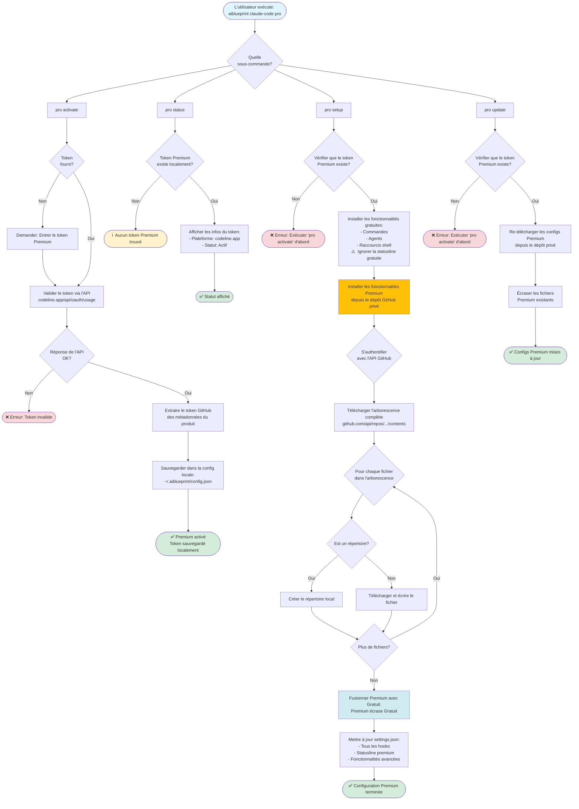

# Workflow des commandes Pro (Premium)

Ce diagramme illustre le workflow des fonctionnalités premium avec authentification par token.



## Fonctionnalités Premium

### Qu'est-ce qui est inclus?

**Commandes Premium**:
- Automatisation de workflow avancée
- Commandes de productivité améliorées
- Templates exclusifs

**Agents Premium**:
- Agents IA spécialisés
- Optimisations spécifiques aux tâches

**Statusline Premium**:
- Métriques avancées
- Visualisations améliorées
- Insights en temps réel

**Hooks Premium**:
- Couches de sécurité supplémentaires
- Optimisations de performance
- Gestionnaires d'événements personnalisés

### Flux d'authentification

1. **Validation du token**: Appel API vers `codeline.app/api/oauth/usage`
2. **Extraction du token GitHub**: Depuis les métadonnées du produit
3. **Stockage local**: Sauvegardé dans `~/.aiblueprint/config.json`
4. **Authentification API**: Utilisé pour l'accès au dépôt privé

### Intégration API

**Endpoint**: `https://codeline.app/api/products`

**Authentification**: Bearer token (token premium)

**Structure de réponse**:
```json
{
  "products": [{
    "metadata": {
      "github_token": "ghp_xxx..."
    }
  }]
}
```

### Premium vs Gratuit

| Fonctionnalité | Gratuit | Premium |
|---------|------|---------|
| Commandes | 16 templates | Bibliothèque étendue |
| Agents | 3 basiques | Agents avancés |
| Statusline | Basique | Métriques améliorées |
| Dépôt GitHub | Public | Privé |
| Support | Communauté | Prioritaire |

## Fichiers associés

- Commande principale: `src/commands/pro.ts`
- Installateur Premium: `src/lib/pro-installer.ts`
- Stockage de config: `~/.aiblueprint/config.json`
- Client API: Intégré dans la commande pro

## Notes de sécurité

- Les tokens premium sont stockés localement (non transmis)
- Les tokens GitHub sont utilisés uniquement pour l'authentification API
- Tous les appels API utilisent HTTPS
- Aucune donnée sensible dans les logs
