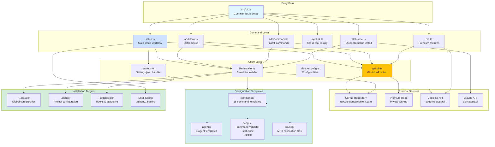

# CLI Architecture

This diagram illustrates the overall architecture of the AIBlueprint CLI application.



## Architecture Layers

### 1. Entry Point Layer

**File**: `src/cli.ts`

**Responsibilities**:
- Parse command-line arguments
- Set up Commander.js command structure
- Handle global options
- Route to appropriate command handler

**Command Structure**:
```
aiblueprint claude-code [options]
├── setup
├── add
│   ├── hook <type>
│   └── commands [name]
├── symlink
├── statusline
└── pro
    ├── activate [token]
    ├── status
    ├── setup
    └── update
```

### 2. Command Layer

Each command is a separate module with specific responsibilities:

#### setup.ts
- Interactive feature selection
- Batch installation of all features
- Dependency management
- Settings.json configuration

#### addHook.ts
- Individual hook installation
- Project vs global detection
- Hook configuration in settings

#### addCommand.ts
- Command discovery and listing
- Individual command installation
- Metadata parsing (YAML frontmatter)

#### symlink.ts
- Cross-tool command/agent sharing
- Symlink creation and validation
- Multi-destination support

#### pro.ts
- Premium token management
- Premium config installation
- API authentication

#### statusline.ts
- Standalone statusline installer
- Quick setup without full installation

### 3. Utility Layer

#### github.ts
**Functions**:
- `isGitHubAvailable()`: Test connectivity
- `downloadFromGitHub()`: Fetch file content
- `listFilesFromGitHub()`: List directory contents
- `downloadAndWriteFile()`: Download + write to disk

#### file-installer.ts
**Smart Fallback Logic**:
1. Try GitHub first
2. Fall back to local `claude-code-config/`
3. Search multiple possible local paths
4. Handle errors gracefully

#### claude-config.ts
**Functions**:
- `getTargetDirectory()`: Determine `.claude/` location
- `findLocalConfigDir()`: Find local config source
- `parseYamlFrontmatter()`: Extract command metadata

#### settings.ts
**Settings Management**:
- Read existing `settings.json`
- Merge new configurations
- Preserve user customizations
- Validate structure

### 4. Configuration Templates

Stored in `claude-code-config/`:

#### Commands (16 templates)
- `/commit`: Quick commits
- `/create-pull-request`: PR creation
- `/deep-code-analysis`: Code review
- `/explain-architecture`: Documentation
- And 12 more...

#### Agents (3 templates)
- `action`: Conditional executor
- `prompt-agent`: Agent generator
- `prompt-command`: Command generator

#### Scripts
- **command-validator**: 700+ line security system
- **statusline**: Real-time metrics display
- **hook-post-file**: TypeScript post-edit validation

#### Sounds
- MP3 notification files for various events

### 5. Installation Targets

#### Global Configuration
**Path**: `~/.claude/`

**Contents**:
- Commands directory
- Agents directory
- Scripts directory
- Settings.json
- Security.log

#### Project Configuration
**Path**: `.claude/` (in git repo)

**Contents**:
- Project-specific hooks
- Project-specific commands
- Uses `$CLAUDE_PROJECT_DIR`

#### Shell Configuration
**Paths**:
- macOS: `~/.zshenv`
- Linux: `~/.bashrc`, `~/.zshrc`

**Content**:
```bash
alias cc='claude --dangerouslySkipPermissions'
alias ccc='cc --continue'
```

## Data Flow Patterns

### Installation Flow
```
User Command
  → CLI Parser
  → Command Handler
  → GitHub Check
  → [Download from GitHub] OR [Use Local Templates]
  → Write to Target Directory
  → Update settings.json
  → Success Report
```

### Hook Execution Flow
```
Claude Code Event
  → Hook Trigger
  → Bun Script Execution
  → Read stdin (JSON input)
  → Process data
  → Write stdout (result)
  → Claude Code Continues/Blocks
```

### Premium Authentication Flow
```
User Token
  → Codeline API Validation
  → Extract GitHub Token
  → Save to Local Config
  → Use for Private Repo Access
  → Download Premium Configs
```

## Dependencies

### Runtime
- **commander**: CLI framework
- **@clack/prompts**: Interactive prompts
- **fs-extra**: File operations
- **chalk**: Terminal colors

### External Tools
- **bun**: Script execution
- **ccusage**: Cost tracking
- **git**: Repository detection
- **gh**: GitHub CLI (optional)

### Build & Test
- **vitest**: Testing framework
- **release-it**: Automated releases
- **@types/\***: TypeScript definitions

## Security Architecture

### Multi-Layer Protection

1. **Input Validation**: All user inputs validated
2. **Command Validation**: PreToolUse hook validates bash commands
3. **Path Validation**: All file operations check paths
4. **API Authentication**: Tokens stored securely
5. **Logging**: Security events logged to file

### Hook-Based Security

**PreToolUse Hook**:
- Validates bash commands before execution
- Blocks dangerous operations
- Logs security events

**PostToolUse Hook**:
- Validates TypeScript files after editing
- Runs linters and type checkers
- Reports errors

## Error Handling

### Graceful Degradation
- GitHub unavailable → Use local templates
- API failure → Continue with cached data
- Missing dependencies → Prompt for installation
- Invalid paths → Skip and continue

### User Feedback
- Clear error messages
- Actionable suggestions
- Success confirmations
- Progress indicators

## Extension Points

### Adding New Commands
1. Create `.md` file in `claude-code-config/commands/`
2. Add YAML frontmatter
3. Write command instructions
4. Commit to repository

### Adding New Hooks
1. Create hook script in `scripts/hooks/`
2. Add to supported hooks list
3. Define hook configuration
4. Update settings.ts

### Adding New Features
1. Create command file in `src/commands/`
2. Register in `src/cli.ts`
3. Add utilities if needed
4. Update documentation

## Testing Strategy

### Integration Tests
- Real CLI execution
- Temporary directory isolation
- File system validation
- Settings.json structure checks

### Test Command
```bash
bun test:run  # Non-interactive mode
```

**Critical Rule**: Always run tests after modifications

## Build & Release

### Build Process
```bash
bun run build
# Compiles TypeScript to dist/cli.js
# Sets executable permissions
```

### Release Process
```bash
bun run release
# Version bump
# Build
# Git tag
# npm publish
```

## Related Documentation

- Main README: `README.md`
- Claude Instructions: `CLAUDE.md`
- Package Config: `package.json`
- TypeScript Config: `tsconfig.json`
