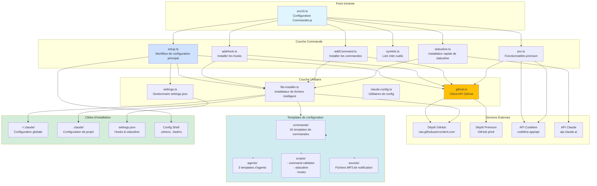

# Architecture du CLI

Ce diagramme illustre l'architecture globale de l'application CLI AIBlueprint.



## Couches d'architecture

### 1. Couche Point d'entrée

**Fichier**: `src/cli.ts`

**Responsabilités**:
- Parser les arguments de ligne de commande
- Configurer la structure de commande Commander.js
- Gérer les options globales
- Router vers le gestionnaire de commande approprié

**Structure de commande**:
```
aiblueprint claude-code [options]
├── setup
├── add
│   ├── hook <type>
│   └── commands [name]
├── symlink
├── statusline
└── pro
    ├── activate [token]
    ├── status
    ├── setup
    └── update
```

### 2. Couche Commande

Chaque commande est un module séparé avec des responsabilités spécifiques:

#### setup.ts
- Sélection interactive de fonctionnalités
- Installation par lot de toutes les fonctionnalités
- Gestion des dépendances
- Configuration de settings.json

#### addHook.ts
- Installation de hook individuel
- Détection projet vs global
- Configuration de hook dans settings

#### addCommand.ts
- Découverte et liste de commandes
- Installation de commande individuelle
- Parsing des métadonnées (frontmatter YAML)

#### symlink.ts
- Partage de commandes/agents inter-outils
- Création et validation de liens symboliques
- Support multi-destinations

#### pro.ts
- Gestion des tokens premium
- Installation de config premium
- Authentification API

#### statusline.ts
- Installateur de statusline autonome
- Configuration rapide sans installation complète

### 3. Couche Utilitaire

#### github.ts
**Fonctions**:
- `isGitHubAvailable()`: Tester la connectivité
- `downloadFromGitHub()`: Récupérer le contenu de fichier
- `listFilesFromGitHub()`: Lister le contenu de répertoire
- `downloadAndWriteFile()`: Télécharger + écrire sur disque

#### file-installer.ts
**Logique de repli intelligente**:
1. Essayer GitHub d'abord
2. Se replier sur local `claude-code-config/`
3. Chercher plusieurs chemins locaux possibles
4. Gérer les erreurs avec élégance

#### claude-config.ts
**Fonctions**:
- `getTargetDirectory()`: Déterminer l'emplacement `.claude/`
- `findLocalConfigDir()`: Trouver la source de config locale
- `parseYamlFrontmatter()`: Extraire les métadonnées de commande

#### settings.ts
**Gestion des paramètres**:
- Lire le `settings.json` existant
- Fusionner les nouvelles configurations
- Préserver les personnalisations utilisateur
- Valider la structure

### 4. Templates de configuration

Stockés dans `claude-code-config/`:

#### Commandes (16 templates)
- `/commit`: Commits rapides
- `/create-pull-request`: Création de PR
- `/deep-code-analysis`: Revue de code
- `/explain-architecture`: Documentation
- Et 12 autres...

#### Agents (3 templates)
- `action`: Exécuteur conditionnel
- `prompt-agent`: Générateur d'agent
- `prompt-command`: Générateur de commande

#### Scripts
- **command-validator**: Système de sécurité de 700+ lignes
- **statusline**: Affichage de métriques en temps réel
- **hook-post-file**: Validation TypeScript post-édition

#### Sounds
- Fichiers MP3 de notification pour divers événements

### 5. Cibles d'installation

#### Configuration globale
**Chemin**: `~/.claude/`

**Contenu**:
- Répertoire des commandes
- Répertoire des agents
- Répertoire des scripts
- Settings.json
- Security.log

#### Configuration de projet
**Chemin**: `.claude/` (dans le dépôt git)

**Contenu**:
- Hooks spécifiques au projet
- Commandes spécifiques au projet
- Utilise `$CLAUDE_PROJECT_DIR`

#### Configuration Shell
**Chemins**:
- macOS: `~/.zshenv`
- Linux: `~/.bashrc`, `~/.zshrc`

**Contenu**:
```bash
alias cc='claude --dangerouslySkipPermissions'
alias ccc='cc --continue'
```

## Flux de données

### Flux d'installation
```
Commande utilisateur
  → Parser CLI
  → Gestionnaire de commande
  → Vérification GitHub
  → [Télécharger depuis GitHub] OU [Utiliser templates locaux]
  → Écrire dans répertoire cible
  → Mettre à jour settings.json
  → Rapport de succès
```

### Flux d'exécution de hook
```
Événement Claude Code
  → Déclenchement du hook
  → Exécution du script Bun
  → Lire stdin (entrée JSON)
  → Traiter les données
  → Écrire stdout (résultat)
  → Claude Code continue/bloque
```

### Flux d'authentification premium
```
Token utilisateur
  → Validation API Codeline
  → Extraire le token GitHub
  → Sauvegarder dans config locale
  → Utiliser pour accès dépôt privé
  → Télécharger configs premium
```

## Dépendances

### Runtime
- **commander**: Framework CLI
- **@clack/prompts**: Prompts interactifs
- **fs-extra**: Opérations de fichiers
- **chalk**: Couleurs de terminal

### Outils externes
- **bun**: Exécution de scripts
- **ccusage**: Suivi des coûts
- **git**: Détection de dépôt
- **gh**: CLI GitHub (optionnel)

### Build & Test
- **vitest**: Framework de test
- **release-it**: Releases automatisées
- **@types/\***: Définitions TypeScript

## Architecture de sécurité

### Protection multi-couches

1. **Validation d'entrée**: Toutes les entrées utilisateur validées
2. **Validation de commande**: Hook PreToolUse valide les commandes bash
3. **Validation de chemin**: Toutes les opérations de fichiers vérifient les chemins
4. **Authentification API**: Tokens stockés en sécurité
5. **Journalisation**: Événements de sécurité enregistrés dans fichier

### Sécurité basée sur les hooks

**Hook PreToolUse**:
- Valide les commandes bash avant exécution
- Bloque les opérations dangereuses
- Enregistre les événements de sécurité

**Hook PostToolUse**:
- Valide les fichiers TypeScript après édition
- Exécute les linters et vérificateurs de types
- Rapporte les erreurs

## Gestion des erreurs

### Dégradation élégante
- GitHub indisponible → Utiliser templates locaux
- Échec API → Continuer avec données en cache
- Dépendances manquantes → Demander l'installation
- Chemins invalides → Ignorer et continuer

### Retour utilisateur
- Messages d'erreur clairs
- Suggestions actionnables
- Confirmations de succès
- Indicateurs de progression

## Points d'extension

### Ajouter de nouvelles commandes
1. Créer un fichier `.md` dans `claude-code-config/commands/`
2. Ajouter le frontmatter YAML
3. Écrire les instructions de commande
4. Commiter dans le dépôt

### Ajouter de nouveaux hooks
1. Créer un script de hook dans `scripts/hooks/`
2. Ajouter à la liste des hooks supportés
3. Définir la configuration du hook
4. Mettre à jour settings.ts

### Ajouter de nouvelles fonctionnalités
1. Créer un fichier de commande dans `src/commands/`
2. Enregistrer dans `src/cli.ts`
3. Ajouter des utilitaires si nécessaire
4. Mettre à jour la documentation

## Stratégie de test

### Tests d'intégration
- Exécution CLI réelle
- Isolation de répertoire temporaire
- Validation du système de fichiers
- Vérifications de structure settings.json

### Commande de test
```bash
bun test:run  # Mode non-interactif
```

**Règle critique**: Toujours exécuter les tests après modifications

## Build & Release

### Processus de build
```bash
bun run build
# Compile TypeScript vers dist/cli.js
# Définit les permissions exécutables
```

### Processus de release
```bash
bun run release
# Bump de version
# Build
# Tag git
# Publication npm
```

## Documentation associée

- README principal: `README.md`
- Instructions Claude: `CLAUDE.md`
- Config Package: `package.json`
- Config TypeScript: `tsconfig.json`
