# Flux d'installation

Ce diagramme illustre le processus d'installation complet de bout en bout, de l'installation du package à la configuration prête à l'emploi.

```mermaid
flowchart TD
    Start([L'utilisateur veut le CLI AIBlueprint]) --> InstallMethod{Méthode<br/>d'installation?}

    InstallMethod --> NPM[npm install -g aiblueprint]
    InstallMethod --> Yarn[yarn global add aiblueprint]
    InstallMethod --> PNPM[pnpm add -g aiblueprint]
    InstallMethod --> Bun[bun add -g aiblueprint]

    NPM --> PackageInstalled
    Yarn --> PackageInstalled
    PNPM --> PackageInstalled
    Bun --> PackageInstalled

    PackageInstalled[Package installé globalement] --> BinAvailable[Binaire disponible: aiblueprint]

    BinAvailable --> UserRuns[L'utilisateur exécute: aiblueprint claude-code setup]

    UserRuns --> CheckFolder{Dossier personnalisé<br/>spécifié?}

    CheckFolder -->|Oui --folder| CustomPath[Utiliser chemin personnalisé]
    CheckFolder -->|Non| DetectPlatform

    CustomPath --> FeatureSelect
    DetectPlatform{Détecter la plateforme} --> MacOS[macOS]
    DetectPlatform --> Linux[Linux]
    DetectPlatform --> Windows[Windows ⚠️ Limité]

    MacOS --> DefaultMac[Par défaut: ~/.claude/]
    Linux --> DefaultLinux[Par défaut: ~/.claude/]
    Windows --> DefaultWin[Par défaut: ~/.claude/]

    DefaultMac --> FeatureSelect
    DefaultLinux --> FeatureSelect
    DefaultWin --> FeatureSelect

    FeatureSelect{Mode de sélection<br/>de fonctionnalités}

    FeatureSelect -->|Flag --skip| SelectAll[Sélectionner toutes les fonctionnalités]
    FeatureSelect -->|Interactif| PromptUser[Demander pour chaque fonctionnalité]

    PromptUser --> Features[Liste des fonctionnalités sélectionnées]
    SelectAll --> Features

    Features --> SourceCheck[Vérification de la source:<br/>GitHub vs Local]

    SourceCheck --> TestGH{Tester la connectivité<br/>GitHub}

    TestGH -->|Succès| UseGitHub[Utiliser GitHub comme source<br/>Toujours les dernières configs]
    TestGH -->|Échec| UseLocalConfig[Utiliser configs locales incluses<br/>Depuis l'installation du package]

    UseGitHub --> BeginInstall
    UseLocalConfig --> BeginInstall

    BeginInstall[Commencer le processus d'installation] --> ParallelInstall{Installer les fonctionnalités<br/>en parallèle}

    %% PARALLEL INSTALLATION BRANCHES
    ParallelInstall --> InstallScripts[Installer les scripts]
    ParallelInstall --> InstallCommands[Installer les commandes]
    ParallelInstall --> InstallAgents[Installer les agents]
    ParallelInstall --> InstallSounds[Installer les sons]
    ParallelInstall --> SetupShell[Configurer les raccourcis shell]

    %% SCRIPTS INSTALLATION
    InstallScripts --> ScriptTypes{Types de scripts}
    ScriptTypes --> CmdValidator[command-validator<br/>Hook de sécurité]
    ScriptTypes --> StatuslineScript[statusline<br/>Affichage de métriques]
    ScriptTypes --> HookPost[hook-post-file<br/>Validation TypeScript]

    CmdValidator --> ScriptsDone
    StatuslineScript --> CheckBun{Bun<br/>installé?}
    HookPost --> ScriptsDone

    CheckBun -->|Non| InstallBun[Installer le runtime Bun]
    CheckBun -->|Oui| BunInstall[Exécuter: bun install<br/>dans le répertoire statusline]

    InstallBun --> BunInstall
    BunInstall --> CheckCCUsage{ccusage<br/>installé?}

    CheckCCUsage -->|Non| InstallCCUsage[Installer ccusage globalement]
    CheckCCUsage -->|Oui| ScriptsDone

    InstallCCUsage --> ScriptsDone[Scripts installés]

    %% COMMANDS INSTALLATION
    InstallCommands --> CopyCommands[Copier 16 templates de commandes<br/>dans ~/.claude/commands/]
    CopyCommands --> CommandsDone[Commandes installées]

    %% AGENTS INSTALLATION
    InstallAgents --> CopyAgents[Copier 3 templates d'agents<br/>dans ~/.claude/agents/]
    CopyAgents --> AgentsDone[Agents installés]

    %% SOUNDS INSTALLATION
    InstallSounds --> CopySounds[Copier fichiers MP3<br/>dans ~/.claude/sounds/]
    CopySounds --> SoundsDone[Sons installés]

    %% SHELL SHORTCUTS
    SetupShell --> DetectShellPlatform{Plateforme?}

    DetectShellPlatform -->|macOS| EditZshenv[Ajouter alias dans ~/.zshenv]
    DetectShellPlatform -->|Linux| DetectLinuxShell{Shell?}
    DetectShellPlatform -->|Windows| SkipShell[Ignorer: Non supporté]

    DetectLinuxShell -->|bash| EditBashrc[Ajouter alias dans ~/.bashrc]
    DetectLinuxShell -->|zsh| EditZshrc[Ajouter alias dans ~/.zshrc]

    EditZshenv --> ShellDone[Raccourcis shell ajoutés:<br/>alias cc, ccc]
    EditBashrc --> ShellDone
    EditZshrc --> ShellDone
    SkipShell --> ShellDone

    %% MERGE POINT
    ScriptsDone --> MergeInstall
    CommandsDone --> MergeInstall
    AgentsDone --> MergeInstall
    SoundsDone --> MergeInstall
    ShellDone --> MergeInstall

    MergeInstall[Toutes les fonctionnalités installées] --> UpdateSettings[Mettre à jour settings.json]

    UpdateSettings --> ReadExisting{settings.json<br/>existe?}

    ReadExisting -->|Oui| MergeSettings[Fusionner avec existant:<br/>Préserver personnalisations utilisateur]
    ReadExisting -->|Non| CreateNew[Créer nouveau settings.json]

    MergeSettings --> WriteSettings
    CreateNew --> WriteSettings

    WriteSettings[Écrire configuration Settings] --> SettingsContent{Ajouter aux Settings}

    SettingsContent --> AddStatusline[StatusLine:<br/>- Commande: bun script<br/>- Métriques temps réel]
    SettingsContent --> AddPreHook[Hook PreToolUse:<br/>- command-validator<br/>- Sécurité Bash]
    SettingsContent --> AddPostHook[Hook PostToolUse:<br/>- hook-post-file<br/>- Validation TypeScript]
    SettingsContent --> AddStopHook[Hook Stop:<br/>- Son de fin]
    SettingsContent --> AddNotifHook[Hook Notification:<br/>- Son besoin-humain]

    AddStatusline --> SettingsSaved
    AddPreHook --> SettingsSaved
    AddPostHook --> SettingsSaved
    AddStopHook --> SettingsSaved
    AddNotifHook --> SettingsSaved

    SettingsSaved[settings.json sauvegardé] --> CreateSymlinks{Créer des liens symboliques<br/>vers autres outils?}

    CreateSymlinks -->|Oui| SymlinkProcess[Exécuter workflow de symlink]
    CreateSymlinks -->|Non| FinalCheck

    SymlinkProcess --> FinalCheck[Vérification finale]

    FinalCheck --> VerifyFiles{Vérifier tous les fichiers<br/>installés?}

    VerifyFiles -->|Non| ShowWarnings[Afficher les avertissements:<br/>Liste des fichiers manquants]
    VerifyFiles -->|Oui| VerifySettings

    ShowWarnings --> VerifySettings{Vérifier Settings<br/>JSON valide?}

    VerifySettings -->|Non| ErrorSettings([❌ Erreur: settings.json invalide])
    VerifySettings -->|Oui| Success

    Success[Générer le rapport de succès] --> DisplayReport{Afficher le rapport}

    DisplayReport --> ShowInstalled[✅ Fonctionnalités installées:<br/>- Commandes: X<br/>- Agents: Y<br/>- Scripts: Z]
    DisplayReport --> ShowNext[📋 Étapes suivantes:<br/>1. Redémarrer le shell<br/>2. Exécuter: claude<br/>3. Essayer: /commit]

    ShowInstalled --> Complete
    ShowNext --> Complete

    Complete([🎉 Installation terminée!<br/>CLI AIBlueprint prêt])

    style Start fill:#e1f5ff
    style Complete fill:#d4edda
    style ErrorSettings fill:#f8d7da
    style ParallelInstall fill:#fff3cd
    style MergeInstall fill:#d1ecf1
    style Success fill:#d4edda
```



## Phases d'installation

### Phase 1: Installation du package

**Méthodes**:
- npm: `npm install -g aiblueprint`
- Yarn: `yarn global add aiblueprint`
- pnpm: `pnpm add -g aiblueprint`
- Bun: `bun add -g aiblueprint`

**Résultat**: Binaire disponible à `aiblueprint`

### Phase 2: Sélection de la source de configuration

**Priorité**:
1. **GitHub** (préféré): Toujours les dernières configs
2. **Local inclus**: Empaqueté avec l'installation npm

**Logique de décision**:
```javascript
if (await isGitHubAvailable()) {
  source = "GitHub"
} else {
  source = "Local"
}
```

### Phase 3: Sélection de fonctionnalités

**Mode interactif**:
```
? Sélectionner les fonctionnalités à installer:
  ◉ Raccourcis shell (alias cc, ccc)
  ◉ Validation de commande (hooks de sécurité)
  ◉ Statusline personnalisée
  ◉ Commandes AIBlueprint (16 templates)
  ◉ Agents AIBlueprint (3 templates)
  ◉ Sons de notification
  ◉ Hook post-édition TypeScript
  ◯ Liens symboliques Codex/OpenCode
```

**Mode Skip** (`--skip`):
- Sélectionne automatiquement toutes les fonctionnalités
- Aucune interaction utilisateur requise
- Installation rapide

### Phase 4: Installation parallèle

Toutes les fonctionnalités s'installent simultanément pour la rapidité:

#### Installation des scripts
1. **command-validator**: Validation de sécurité
2. **statusline**: Affichage de métriques
3. **hook-post-file**: Validation TypeScript

**Vérification des dépendances**:
- Runtime Bun (auto-installation si manquant)
- Package ccusage (auto-installation si manquant)

#### Installation des commandes
- Copie 16 templates de commandes
- Cible: `~/.claude/commands/`
- Source: GitHub ou local

#### Installation des agents
- Copie 3 templates d'agents
- Cible: `~/.claude/agents/`
- Source: GitHub ou local

#### Installation des sons
- Copie fichiers MP3 de notification
- Cible: `~/.claude/sounds/`
- Utilisés pour notifications d'événements

#### Raccourcis shell
**macOS**: Ajoute dans `~/.zshenv`
**Linux**: Ajoute dans `~/.bashrc` ou `~/.zshrc`
**Windows**: Ignoré (non supporté)

**Alias**:
```bash
alias cc='claude --dangerouslySkipPermissions'
alias ccc='cc --continue'
```

### Phase 5: Configuration des paramètres

**Structure de settings.json**:
```json
{
  "statusLine": {
    "command": "bun ~/.claude/scripts/statusline/src/index.ts"
  },
  "hooks": {
    "PreToolUse": {
      "path": "~/.claude/scripts/command-validator/command-validator.js",
      "matcher": "Bash"
    },
    "PostToolUse": {
      "path": "~/.claude/scripts/hooks/hook-post-file",
      "matcher": "Edit|Write|MultiEdit"
    },
    "Stop": {
      "command": "afplay ~/.claude/sounds/finish.mp3"
    },
    "Notification": {
      "command": "afplay ~/.claude/sounds/need-human.mp3"
    }
  }
}
```

**Stratégie de fusion**:
- Lire les paramètres existants
- Préserver les personnalisations utilisateur
- Ajouter nouvelles configurations
- Éviter les doublons

### Phase 6: Vérification & Rapport

**Étapes de vérification**:
1. Vérifier que tous les fichiers existent
2. Valider la syntaxe settings.json
3. Tester l'exécutabilité des hooks
4. Vérifier la config shell

**Rapport de succès**:
```
✅ Installation terminée!

Fonctionnalités installées:
  • Commandes: 16 templates
  • Agents: 3 templates
  • Scripts: 3 scripts de sécurité & utilitaires
  • Sons: 2 fichiers de notification
  • Raccourcis shell: alias cc, ccc

Étapes suivantes:
  1. Redémarrez votre shell (ou exécutez: source ~/.zshenv)
  2. Exécutez: claude
  3. Essayez votre première commande: /commit

Documentation: https://github.com/Melvynx/aiblueprint-cli
```

## Chemins d'installation

### Emplacements par défaut

| Item | Chemin |
|------|------|
| Commandes | `~/.claude/commands/` |
| Agents | `~/.claude/agents/` |
| Scripts | `~/.claude/scripts/` |
| Sons | `~/.claude/sounds/` |
| Paramètres | `~/.claude/settings.json` |
| Journal de sécurité | `~/.claude/security.log` |

### Emplacements personnalisés

Utiliser le flag `--folder`:
```bash
aiblueprint claude-code setup --folder /custom/path
```

## Différences de plateforme

### macOS (Support complet)
- Shell: `.zshenv`
- Audio: Commande `afplay`
- Keychain: Disponible pour secrets
- Permissions de fichiers: Support complet

### Linux (Support partiel)
- Shell: `.bashrc` ou `.zshrc`
- Audio: Peut nécessiter `mpg123` ou `sox`
- Keychain: Non disponible
- Permissions de fichiers: Support complet

### Windows (Support limité)
- Shell: Non supporté
- Audio: Non supporté
- Chemins: Résolution de chemin différente
- Liens symboliques: Peut nécessiter droits admin

## Dépannage

### Échec de connexion GitHub
**Symptôme**: Utilise configs locales au lieu des dernières

**Solution**:
- Vérifier la connexion internet
- Vérifier que GitHub n'est pas bloqué
- Re-exécuter quand en ligne

### Échec d'installation de Bun
**Symptôme**: Statusline ne fonctionne pas

**Solution**:
```bash
curl -fsSL https://bun.sh/install | bash
```

### Settings.json invalide
**Symptôme**: L'installation échoue à la fusion des settings

**Solution**:
- Sauvegarder settings.json existant
- Supprimer fichier corrompu
- Re-exécuter l'installation

### Raccourcis shell ne fonctionnent pas
**Symptôme**: Commandes `cc` et `ccc` introuvables

**Solution**:
```bash
# Recharger la config shell
source ~/.zshenv  # macOS
source ~/.bashrc  # Linux bash
source ~/.zshrc   # Linux zsh
```

## Fichiers associés

- Commande Setup: `src/commands/setup.ts`
- Installateur de fichiers: `src/utils/file-installer.ts`
- Gestionnaire de paramètres: `src/commands/setup/settings.ts`
- Utilitaires GitHub: `src/utils/github.ts`
