# Installation Flow

This diagram illustrates the complete installation flow from package installation to ready-to-use configuration.

```mermaid
flowchart TD
    Start([User wants AIBlueprint CLI]) --> InstallMethod{Installation<br/>Method?}

    InstallMethod --> NPM[npm install -g aiblueprint]
    InstallMethod --> Yarn[yarn global add aiblueprint]
    InstallMethod --> PNPM[pnpm add -g aiblueprint]
    InstallMethod --> Bun[bun add -g aiblueprint]

    NPM --> PackageInstalled
    Yarn --> PackageInstalled
    PNPM --> PackageInstalled
    Bun --> PackageInstalled

    PackageInstalled[Package Installed Globally] --> BinAvailable[Binary available: aiblueprint]

    BinAvailable --> UserRuns[User runs: aiblueprint claude-code setup]

    UserRuns --> CheckFolder{Custom Folder<br/>Specified?}

    CheckFolder -->|Yes --folder| CustomPath[Use Custom Path]
    CheckFolder -->|No| DetectPlatform

    CustomPath --> FeatureSelect
    DetectPlatform{Detect Platform} --> MacOS[macOS]
    DetectPlatform --> Linux[Linux]
    DetectPlatform --> Windows[Windows ⚠️ Limited]

    MacOS --> DefaultMac[Default: ~/.claude/]
    Linux --> DefaultLinux[Default: ~/.claude/]
    Windows --> DefaultWin[Default: ~/.claude/]

    DefaultMac --> FeatureSelect
    DefaultLinux --> FeatureSelect
    DefaultWin --> FeatureSelect

    FeatureSelect{Feature Selection<br/>Mode}

    FeatureSelect -->|--skip flag| SelectAll[Select All Features]
    FeatureSelect -->|Interactive| PromptUser[Prompt for Each Feature]

    PromptUser --> Features[Selected Features List]
    SelectAll --> Features

    Features --> SourceCheck[Source Check:<br/>GitHub vs Local]

    SourceCheck --> TestGH{Test GitHub<br/>Connectivity}

    TestGH -->|Success| UseGitHub[Use GitHub as Source<br/>Always latest configs]
    TestGH -->|Fail| UseLocalConfig[Use Local Bundled Configs<br/>From package installation]

    UseGitHub --> BeginInstall
    UseLocalConfig --> BeginInstall

    BeginInstall[Begin Installation Process] --> ParallelInstall{Install Features<br/>in Parallel}

    %% PARALLEL INSTALLATION BRANCHES
    ParallelInstall --> InstallScripts[Install Scripts]
    ParallelInstall --> InstallCommands[Install Commands]
    ParallelInstall --> InstallAgents[Install Agents]
    ParallelInstall --> InstallSounds[Install Sounds]
    ParallelInstall --> SetupShell[Setup Shell Shortcuts]

    %% SCRIPTS INSTALLATION
    InstallScripts --> ScriptTypes{Script Types}
    ScriptTypes --> CmdValidator[command-validator<br/>Security hook]
    ScriptTypes --> StatuslineScript[statusline<br/>Metrics display]
    ScriptTypes --> HookPost[hook-post-file<br/>TypeScript validation]

    CmdValidator --> ScriptsDone
    StatuslineScript --> CheckBun{Bun<br/>Installed?}
    HookPost --> ScriptsDone

    CheckBun -->|No| InstallBun[Install Bun Runtime]
    CheckBun -->|Yes| BunInstall[Run: bun install<br/>in statusline dir]

    InstallBun --> BunInstall
    BunInstall --> CheckCCUsage{ccusage<br/>Installed?}

    CheckCCUsage -->|No| InstallCCUsage[Install ccusage globally]
    CheckCCUsage -->|Yes| ScriptsDone

    InstallCCUsage --> ScriptsDone[Scripts Installed]

    %% COMMANDS INSTALLATION
    InstallCommands --> CopyCommands[Copy 16 command templates<br/>to ~/.claude/commands/]
    CopyCommands --> CommandsDone[Commands Installed]

    %% AGENTS INSTALLATION
    InstallAgents --> CopyAgents[Copy 3 agent templates<br/>to ~/.claude/agents/]
    CopyAgents --> AgentsDone[Agents Installed]

    %% SOUNDS INSTALLATION
    InstallSounds --> CopySounds[Copy MP3 files<br/>to ~/.claude/sounds/]
    CopySounds --> SoundsDone[Sounds Installed]

    %% SHELL SHORTCUTS
    SetupShell --> DetectShellPlatform{Platform?}

    DetectShellPlatform -->|macOS| EditZshenv[Add aliases to ~/.zshenv]
    DetectShellPlatform -->|Linux| DetectLinuxShell{Shell?}
    DetectShellPlatform -->|Windows| SkipShell[Skip: Not supported]

    DetectLinuxShell -->|bash| EditBashrc[Add aliases to ~/.bashrc]
    DetectLinuxShell -->|zsh| EditZshrc[Add aliases to ~/.zshrc]

    EditZshenv --> ShellDone[Shell Shortcuts Added:<br/>cc, ccc aliases]
    EditBashrc --> ShellDone
    EditZshrc --> ShellDone
    SkipShell --> ShellDone

    %% MERGE POINT
    ScriptsDone --> MergeInstall
    CommandsDone --> MergeInstall
    AgentsDone --> MergeInstall
    SoundsDone --> MergeInstall
    ShellDone --> MergeInstall

    MergeInstall[All Features Installed] --> UpdateSettings[Update settings.json]

    UpdateSettings --> ReadExisting{settings.json<br/>Exists?}

    ReadExisting -->|Yes| MergeSettings[Merge with Existing:<br/>Preserve user customizations]
    ReadExisting -->|No| CreateNew[Create New settings.json]

    MergeSettings --> WriteSettings
    CreateNew --> WriteSettings

    WriteSettings[Write Settings Configuration] --> SettingsContent{Add to Settings}

    SettingsContent --> AddStatusline[StatusLine:<br/>- Command: bun script<br/>- Real-time metrics]
    SettingsContent --> AddPreHook[PreToolUse Hook:<br/>- command-validator<br/>- Bash security]
    SettingsContent --> AddPostHook[PostToolUse Hook:<br/>- hook-post-file<br/>- TypeScript validation]
    SettingsContent --> AddStopHook[Stop Hook:<br/>- Finish sound]
    SettingsContent --> AddNotifHook[Notification Hook:<br/>- Need-human sound]

    AddStatusline --> SettingsSaved
    AddPreHook --> SettingsSaved
    AddPostHook --> SettingsSaved
    AddStopHook --> SettingsSaved
    AddNotifHook --> SettingsSaved

    SettingsSaved[settings.json Saved] --> CreateSymlinks{Create Symlinks<br/>to Other Tools?}

    CreateSymlinks -->|Yes| SymlinkProcess[Run Symlink Workflow]
    CreateSymlinks -->|No| FinalCheck

    SymlinkProcess --> FinalCheck[Final Verification]

    FinalCheck --> VerifyFiles{Verify All Files<br/>Installed?}

    VerifyFiles -->|No| ShowWarnings[Show Warnings:<br/>Missing files list]
    VerifyFiles -->|Yes| VerifySettings

    ShowWarnings --> VerifySettings{Verify Settings<br/>Valid JSON?}

    VerifySettings -->|No| ErrorSettings([❌ Error: Invalid settings.json])
    VerifySettings -->|Yes| Success

    Success[Generate Success Report] --> DisplayReport{Display Report}

    DisplayReport --> ShowInstalled[✅ Installed Features:<br/>- Commands: X<br/>- Agents: Y<br/>- Scripts: Z]
    DisplayReport --> ShowNext[📋 Next Steps:<br/>1. Restart shell<br/>2. Run: claude<br/>3. Try: /commit]

    ShowInstalled --> Complete
    ShowNext --> Complete

    Complete([🎉 Installation Complete!<br/>AIBlueprint CLI Ready])

    style Start fill:#e1f5ff
    style Complete fill:#d4edda
    style ErrorSettings fill:#f8d7da
    style ParallelInstall fill:#fff3cd
    style MergeInstall fill:#d1ecf1
    style Success fill:#d4edda
```



## Installation Phases

### Phase 1: Package Installation

**Methods**:
- npm: `npm install -g aiblueprint`
- Yarn: `yarn global add aiblueprint`
- pnpm: `pnpm add -g aiblueprint`
- Bun: `bun add -g aiblueprint`

**Result**: Binary available at `aiblueprint`

### Phase 2: Configuration Source Selection

**Priority**:
1. **GitHub** (preferred): Always latest configs
2. **Local Bundled**: Packaged with npm installation

**Decision Logic**:
```javascript
if (await isGitHubAvailable()) {
  source = "GitHub"
} else {
  source = "Local"
}
```

### Phase 3: Feature Selection

**Interactive Mode**:
```
? Select features to install:
  ◉ Shell shortcuts (cc, ccc aliases)
  ◉ Command validation (security hooks)
  ◉ Custom statusline
  ◉ AIBlueprint commands (16 templates)
  ◉ AIBlueprint agents (3 templates)
  ◉ Notification sounds
  ◉ Post-edit TypeScript hook
  ◯ Codex/OpenCode symlinks
```

**Skip Mode** (`--skip`):
- Selects all features automatically
- No user interaction required
- Fast installation

### Phase 4: Parallel Installation

All features install concurrently for speed:

#### Scripts Installation
1. **command-validator**: Security validation
2. **statusline**: Metrics display
3. **hook-post-file**: TypeScript validation

**Dependencies Check**:
- Bun runtime (auto-install if missing)
- ccusage package (auto-install if missing)

#### Commands Installation
- Copies 16 command templates
- Target: `~/.claude/commands/`
- Source: GitHub or local

#### Agents Installation
- Copies 3 agent templates
- Target: `~/.claude/agents/`
- Source: GitHub or local

#### Sounds Installation
- Copies MP3 notification files
- Target: `~/.claude/sounds/`
- Used for event notifications

#### Shell Shortcuts
**macOS**: Adds to `~/.zshenv`
**Linux**: Adds to `~/.bashrc` or `~/.zshrc`
**Windows**: Skipped (not supported)

**Aliases**:
```bash
alias cc='claude --dangerouslySkipPermissions'
alias ccc='cc --continue'
```

### Phase 5: Settings Configuration

**settings.json Structure**:
```json
{
  "statusLine": {
    "command": "bun ~/.claude/scripts/statusline/src/index.ts"
  },
  "hooks": {
    "PreToolUse": {
      "path": "~/.claude/scripts/command-validator/command-validator.js",
      "matcher": "Bash"
    },
    "PostToolUse": {
      "path": "~/.claude/scripts/hooks/hook-post-file",
      "matcher": "Edit|Write|MultiEdit"
    },
    "Stop": {
      "command": "afplay ~/.claude/sounds/finish.mp3"
    },
    "Notification": {
      "command": "afplay ~/.claude/sounds/need-human.mp3"
    }
  }
}
```

**Merge Strategy**:
- Read existing settings
- Preserve user customizations
- Add new configurations
- Avoid duplicates

### Phase 6: Verification & Report

**Verification Steps**:
1. Check all files exist
2. Validate settings.json syntax
3. Test hook executability
4. Verify shell config

**Success Report**:
```
✅ Installation Complete!

Installed Features:
  • Commands: 16 templates
  • Agents: 3 templates
  • Scripts: 3 security & utility scripts
  • Sounds: 2 notification files
  • Shell Shortcuts: cc, ccc aliases

Next Steps:
  1. Restart your shell (or run: source ~/.zshenv)
  2. Run: claude
  3. Try your first command: /commit

Documentation: https://github.com/Melvynx/aiblueprint-cli
```

## Installation Paths

### Default Locations

| Item | Path |
|------|------|
| Commands | `~/.claude/commands/` |
| Agents | `~/.claude/agents/` |
| Scripts | `~/.claude/scripts/` |
| Sounds | `~/.claude/sounds/` |
| Settings | `~/.claude/settings.json` |
| Security Log | `~/.claude/security.log` |

### Custom Locations

Use `--folder` flag:
```bash
aiblueprint claude-code setup --folder /custom/path
```

## Platform Differences

### macOS (Full Support)
- Shell: `.zshenv`
- Audio: `afplay` command
- Keychain: Available for secrets
- File Permissions: Full support

### Linux (Partial Support)
- Shell: `.bashrc` or `.zshrc`
- Audio: May require `mpg123` or `sox`
- Keychain: Not available
- File Permissions: Full support

### Windows (Limited Support)
- Shell: Not supported
- Audio: Not supported
- Paths: Different path resolution
- Symlinks: May require admin rights

## Troubleshooting

### GitHub Connection Failed
**Symptom**: Uses local configs instead of latest

**Solution**:
- Check internet connection
- Verify GitHub is not blocked
- Run again when online

### Bun Installation Failed
**Symptom**: Statusline not working

**Solution**:
```bash
curl -fsSL https://bun.sh/install | bash
```

### Settings.json Invalid
**Symptom**: Installation fails at settings merge

**Solution**:
- Backup existing settings.json
- Delete corrupted file
- Re-run installation

### Shell Shortcuts Not Working
**Symptom**: `cc` and `ccc` commands not found

**Solution**:
```bash
# Reload shell config
source ~/.zshenv  # macOS
source ~/.bashrc  # Linux bash
source ~/.zshrc   # Linux zsh
```

## Related Files

- Setup Command: `src/commands/setup.ts`
- File Installer: `src/utils/file-installer.ts`
- Settings Handler: `src/commands/setup/settings.ts`
- GitHub Utils: `src/utils/github.ts`
