# Testing Workflow

This diagram illustrates the testing workflow and critical development practices for the AIBlueprint CLI.

```mermaid
flowchart TD
    Start([Developer Makes Code Changes]) --> ModifyCode[Modify TypeScript Files:<br/>- Commands<br/>- Utils<br/>- CLI structure]

    ModifyCode --> CriticalRule[🚨 CRITICAL RULE:<br/>ALWAYS run tests after changes]

    CriticalRule --> RunTests[Execute: bun test:run]

    RunTests --> TestFramework[Vitest Test Framework] --> LoadConfig[Load vitest.config.ts]

    LoadConfig --> ConfigSettings{Test Configuration}

    ConfigSettings --> Pattern[Pattern: tests/**/*.test.ts]
    ConfigSettings --> Env[Environment: Node]
    ConfigSettings --> Timeout[Timeout: 30 seconds]
    ConfigSettings --> Isolate[Isolate: false<br/>Persists file writes]

    Pattern --> FindTests
    Env --> FindTests
    Timeout --> FindTests
    Isolate --> FindTests

    FindTests[Discover Test Files] --> IntegrationTest[tests/setup.integration.test.ts]

    IntegrationTest --> TestSuite{Integration Test Suite}

    TestSuite --> Setup1[Test 1: Setup Command Execution]
    TestSuite --> Setup2[Test 2: Settings Validation]
    TestSuite --> Setup3[Test 3: File Installation]

    %% TEST 1: SETUP COMMAND
    Setup1 --> CreateTemp1[Create Temporary Directory]
    CreateTemp1 --> SetEnv1[Set Environment Variables:<br/>- HOME: temp dir<br/>- CLAUDE_CODE_FOLDER: temp/.claude]

    SetEnv1 --> ExecuteCLI1[Execute Real CLI Command:<br/>bun src/cli.ts claude-code --skip setup]

    ExecuteCLI1 --> WaitFiles1[Wait for File Creation:<br/>Max 10 seconds<br/>GitHub API delay]

    WaitFiles1 --> CheckSuccess1{Command<br/>Succeeded?}

    CheckSuccess1 -->|No| Fail1([❌ Test Failed:<br/>CLI execution error])
    CheckSuccess1 -->|Yes| Verify1[Verify Files Created:<br/>- commands/<br/>- agents/<br/>- scripts/<br/>- settings.json]

    Verify1 --> Assert1{All Files<br/>Present?}

    Assert1 -->|No| Fail2([❌ Test Failed:<br/>Missing files])
    Assert1 -->|Yes| Pass1[✅ Test 1 Passed]

    %% TEST 2: SETTINGS VALIDATION
    Setup2 --> CreateTemp2[Create Temporary Directory]
    CreateTemp2 --> ExecuteCLI2[Execute CLI:<br/>Setup with all features]

    ExecuteCLI2 --> WaitFiles2[Wait for Installation]

    WaitFiles2 --> ReadSettings[Read settings.json]

    ReadSettings --> ParseJSON{Parse JSON<br/>Valid?}

    ParseJSON -->|No| Fail3([❌ Test Failed:<br/>Invalid JSON])
    ParseJSON -->|Yes| ValidateStructure[Validate Structure]

    ValidateStructure --> CheckHooks{All Hooks<br/>Configured?}

    CheckHooks --> VerifyPreToolUse[PreToolUse: command-validator]
    CheckHooks --> VerifyPostToolUse[PostToolUse: hook-post-file]
    CheckHooks --> VerifyStop[Stop: finish sound]
    CheckHooks --> VerifyNotif[Notification: need-human sound]

    VerifyPreToolUse --> CheckStatusline
    VerifyPostToolUse --> CheckStatusline
    VerifyStop --> CheckStatusline
    VerifyNotif --> CheckStatusline

    CheckStatusline{Statusline<br/>Configured?}

    CheckStatusline -->|No| Fail4([❌ Test Failed:<br/>Missing statusline])
    CheckStatusline -->|Yes| Pass2[✅ Test 2 Passed]

    %% TEST 3: FILE INSTALLATION
    Setup3 --> CreateTemp3[Create Temporary Directory]
    CreateTemp3 --> ExecuteCLI3[Execute CLI:<br/>Selective feature install]

    ExecuteCLI3 --> WaitFiles3[Wait for Installation]

    WaitFiles3 --> CheckCommands{Verify Commands<br/>Installed?}

    CheckCommands --> CountCmd[Count .md files<br/>in commands/]

    CountCmd --> AssertCount1{Count == 16?}

    AssertCount1 -->|No| Fail5([❌ Test Failed:<br/>Wrong command count])
    AssertCount1 -->|Yes| CheckAgents

    CheckAgents{Verify Agents<br/>Installed?}

    CheckAgents --> CountAgent[Count .md files<br/>in agents/]

    CountAgent --> AssertCount2{Count == 3?}

    AssertCount2 -->|No| Fail6([❌ Test Failed:<br/>Wrong agent count])
    AssertCount2 -->|Yes| CheckScripts

    CheckScripts{Verify Scripts<br/>Installed?}

    CheckScripts --> CheckValidator[command-validator exists?]
    CheckScripts --> CheckStatuslineScript[statusline exists?]
    CheckScripts --> CheckHookPost[hook-post-file exists?]

    CheckValidator --> AssertScripts
    CheckStatuslineScript --> AssertScripts
    CheckHookPost --> AssertScripts

    AssertScripts{All Scripts<br/>Present?}

    AssertScripts -->|No| Fail7([❌ Test Failed:<br/>Missing scripts])
    AssertScripts -->|Yes| Pass3[✅ Test 3 Passed]

    %% MERGE RESULTS
    Pass1 --> CollectResults
    Pass2 --> CollectResults
    Pass3 --> CollectResults

    CollectResults[Collect All Test Results] --> Cleanup[Cleanup Temporary Directories]

    Cleanup --> GenerateReport[Generate Test Report]

    GenerateReport --> AllPassed{All Tests<br/>Passed?}

    AllPassed -->|No| TestsFailed([❌ TESTS FAILED<br/>Fix issues before commit])
    AllPassed -->|Yes| TestsSuccess([✅ ALL TESTS PASSED<br/>Safe to commit])

    TestsSuccess --> SafeCommit[Developer can commit changes]

    style Start fill:#e1f5ff
    style TestsSuccess fill:#d4edda
    style SafeCommit fill:#d4edda
    style TestsFailed fill:#f8d7da
    style Fail1 fill:#f8d7da
    style Fail2 fill:#f8d7da
    style Fail3 fill:#f8d7da
    style Fail4 fill:#f8d7da
    style Fail5 fill:#f8d7da
    style Fail6 fill:#f8d7da
    style Fail7 fill:#f8d7da
    style CriticalRule fill:#ffc107
```



## Critical Development Rules

### Rule #1: Always Test After Changes
```bash
# REQUIRED after every modification
bun test:run
```

**Why `test:run` specifically?**
- Runs in non-interactive mode
- Avoids hanging on prompts
- CI/CD compatible
- Fast execution

### Rule #2: Never Skip Tests
❌ **WRONG**:
```bash
git add .
git commit -m "fix: update setup"
git push
```

✅ **CORRECT**:
```bash
# Make changes
bun test:run
# Only if tests pass:
git add .
git commit -m "fix: update setup"
git push
```

### Rule #3: Use Tests to Validate
Instead of manual testing:
```bash
# ❌ Don't do this
aiblueprint claude-code setup --skip
# Manually check files

# ✅ Do this
bun test:run
# Automated validation
```

## Test Configuration

**File**: `vitest.config.ts`

```typescript
export default defineConfig({
  test: {
    environment: 'node',
    include: ['tests/**/*.test.ts'],
    timeout: 30000,
    isolate: false, // Allows file writes to persist
  },
})
```

## Integration Test Structure

**File**: `tests/setup.integration.test.ts`

### Test 1: Basic Setup Execution
```typescript
test('setup command executes successfully', async () => {
  const tempDir = await createTempDir()
  process.env.HOME = tempDir

  await exec('bun src/cli.ts claude-code --skip setup')

  // Wait for GitHub API
  await waitForFiles(tempDir, 10000)

  expect(fs.existsSync(`${tempDir}/.claude/settings.json`)).toBe(true)
})
```

### Test 2: Settings Validation
```typescript
test('settings.json has correct structure', async () => {
  const settings = JSON.parse(
    fs.readFileSync(`${tempDir}/.claude/settings.json`, 'utf-8')
  )

  expect(settings.hooks.PreToolUse).toBeDefined()
  expect(settings.hooks.PostToolUse).toBeDefined()
  expect(settings.statusLine).toBeDefined()
})
```

### Test 3: File Installation
```typescript
test('all commands and agents are installed', async () => {
  const commands = fs.readdirSync(`${tempDir}/.claude/commands`)
  const agents = fs.readdirSync(`${tempDir}/.claude/agents`)

  expect(commands.length).toBe(16)
  expect(agents.length).toBe(3)
})
```

## Test Execution Flow

### 1. Temporary Environment Setup
- Creates isolated temp directory
- Sets environment variables
- Prevents pollution of real config

### 2. Real CLI Execution
- Runs actual compiled CLI
- Uses `--skip` for non-interactive mode
- Simulates real user experience

### 3. Asynchronous Validation
- Waits for GitHub downloads
- Polls for file creation
- Timeout after 10 seconds

### 4. Comprehensive Assertions
- File existence checks
- JSON structure validation
- Content verification
- Count validation

### 5. Cleanup
- Removes temporary directories
- Restores environment
- Frees disk space

## Test Output

### Success Output
```
✓ tests/setup.integration.test.ts (3)
  ✓ setup command executes successfully (5234ms)
  ✓ settings.json has correct structure (102ms)
  ✓ all commands and agents are installed (89ms)

Test Files  1 passed (1)
     Tests  3 passed (3)
  Start at  14:30:45
  Duration  5.50s
```

### Failure Output
```
✗ tests/setup.integration.test.ts (1)
  ✗ setup command executes successfully (5234ms)
    AssertionError: expected false to be true

    Expected: true
    Received: false

    at tests/setup.integration.test.ts:45:10

Test Files  1 failed (1)
     Tests  1 failed | 2 passed (3)
  Start at  14:32:12
  Duration  5.48s
```

## Test-Driven Development Workflow

### 1. Write Test First (Optional)
```typescript
test('new feature works', async () => {
  // Test for new feature
  const result = await newFeature()
  expect(result).toBe(expected)
})
```

### 2. Implement Feature
```typescript
// src/commands/newFeature.ts
export async function newFeature() {
  // Implementation
}
```

### 3. Run Tests
```bash
bun test:run
```

### 4. Iterate Until Pass
- Fix failing tests
- Refactor code
- Run tests again
- Repeat until all pass

### 5. Commit
```bash
git add .
git commit -m "feat: add new feature"
```

## CI/CD Integration

### GitHub Actions Example
```yaml
name: Tests

on: [push, pull_request]

jobs:
  test:
    runs-on: ubuntu-latest
    steps:
      - uses: actions/checkout@v3
      - uses: oven-sh/setup-bun@v1
      - run: bun install
      - run: bun test:run
```

### Pre-commit Hook
```bash
#!/bin/bash
# .git/hooks/pre-commit

echo "Running tests..."
bun test:run

if [ $? -ne 0 ]; then
  echo "Tests failed. Commit aborted."
  exit 1
fi
```

## Debugging Failed Tests

### Enable Verbose Output
```bash
bun test:run --reporter=verbose
```

### Run Single Test
```bash
bun test:run tests/setup.integration.test.ts
```

### Add Debug Logs
```typescript
test('debug test', async () => {
  console.log('Before execution')
  const result = await someFunction()
  console.log('Result:', result)
  expect(result).toBe(expected)
})
```

### Preserve Temp Directory
```typescript
const tempDir = await createTempDir()
console.log('Temp dir:', tempDir)
// Don't cleanup - inspect manually
```

## Common Test Issues

### Issue: GitHub API Timeout
**Symptom**: Tests fail after 10 seconds

**Solution**:
- Check internet connection
- Increase timeout in test
- Use local config instead

### Issue: File Permissions
**Symptom**: Cannot write to temp directory

**Solution**:
```bash
chmod +x dist/cli.js
```

### Issue: Existing Config Conflict
**Symptom**: Tests fail due to existing `~/.claude/`

**Solution**: Tests use isolated temp directories, not real home

### Issue: JSON Parse Error
**Symptom**: `SyntaxError: Unexpected token`

**Solution**: Validate settings.json generation logic

## Best Practices

### ✅ Do's
- Always run `bun test:run` after changes
- Add tests for new features
- Keep tests fast (< 30s total)
- Use descriptive test names
- Clean up temp files

### ❌ Don'ts
- Don't skip tests before commit
- Don't use `test:watch` in CI/CD
- Don't modify real `~/.claude/` in tests
- Don't leave debug logs in production
- Don't ignore test failures

## Related Files

- Test Config: `vitest.config.ts`
- Integration Tests: `tests/setup.integration.test.ts`
- Package Scripts: `package.json` (test:run)
- CI Config: `.github/workflows/` (if exists)

## Next Steps After Passing Tests

1. ✅ All tests pass
2. Build: `bun run build`
3. Manual smoke test (optional)
4. Commit changes
5. Push to repository
6. Create pull request
