# Workflow de test

Ce diagramme illustre le workflow de test et les pratiques de développement critiques pour le CLI AIBlueprint.

```mermaid
flowchart TD
    Start([Le développeur fait des changements de code]) --> ModifyCode[Modifier les fichiers TypeScript:<br/>- Commandes<br/>- Utilitaires<br/>- Structure CLI]

    ModifyCode --> CriticalRule[🚨 RÈGLE CRITIQUE:<br/>TOUJOURS exécuter les tests après changements]

    CriticalRule --> RunTests[Exécuter: bun test:run]

    RunTests --> TestFramework[Framework de test Vitest] --> LoadConfig[Charger vitest.config.ts]

    LoadConfig --> ConfigSettings{Configuration de test}

    ConfigSettings --> Pattern[Pattern: tests/**/*.test.ts]
    ConfigSettings --> Env[Environnement: Node]
    ConfigSettings --> Timeout[Timeout: 30 secondes]
    ConfigSettings --> Isolate[Isolate: false<br/>Persiste les écritures de fichiers]

    Pattern --> FindTests
    Env --> FindTests
    Timeout --> FindTests
    Isolate --> FindTests

    FindTests[Découvrir les fichiers de test] --> IntegrationTest[tests/setup.integration.test.ts]

    IntegrationTest --> TestSuite{Suite de tests d'intégration}

    TestSuite --> Setup1[Test 1: Exécution commande Setup]
    TestSuite --> Setup2[Test 2: Validation Settings]
    TestSuite --> Setup3[Test 3: Installation fichiers]

    %% TEST 1: SETUP COMMAND
    Setup1 --> CreateTemp1[Créer répertoire temporaire]
    CreateTemp1 --> SetEnv1[Définir variables d'environnement:<br/>- HOME: répertoire temp<br/>- CLAUDE_CODE_FOLDER: temp/.claude]

    SetEnv1 --> ExecuteCLI1[Exécuter commande CLI réelle:<br/>bun src/cli.ts claude-code --skip setup]

    ExecuteCLI1 --> WaitFiles1[Attendre création fichiers:<br/>Max 10 secondes<br/>Délai API GitHub]

    WaitFiles1 --> CheckSuccess1{Commande<br/>réussie?}

    CheckSuccess1 -->|Non| Fail1([❌ Test échoué:<br/>Erreur exécution CLI])
    CheckSuccess1 -->|Oui| Verify1[Vérifier fichiers créés:<br/>- commands/<br/>- agents/<br/>- scripts/<br/>- settings.json]

    Verify1 --> Assert1{Tous les fichiers<br/>présents?}

    Assert1 -->|Non| Fail2([❌ Test échoué:<br/>Fichiers manquants])
    Assert1 -->|Oui| Pass1[✅ Test 1 réussi]

    %% TEST 2: SETTINGS VALIDATION
    Setup2 --> CreateTemp2[Créer répertoire temporaire]
    CreateTemp2 --> ExecuteCLI2[Exécuter CLI:<br/>Setup avec toutes fonctionnalités]

    ExecuteCLI2 --> WaitFiles2[Attendre l'installation]

    WaitFiles2 --> ReadSettings[Lire settings.json]

    ReadSettings --> ParseJSON{Parser JSON<br/>Valide?}

    ParseJSON -->|Non| Fail3([❌ Test échoué:<br/>JSON invalide])
    ParseJSON -->|Oui| ValidateStructure[Valider la structure]

    ValidateStructure --> CheckHooks{Tous les hooks<br/>configurés?}

    CheckHooks --> VerifyPreToolUse[PreToolUse: command-validator]
    CheckHooks --> VerifyPostToolUse[PostToolUse: hook-post-file]
    CheckHooks --> VerifyStop[Stop: son de fin]
    CheckHooks --> VerifyNotif[Notification: son besoin-humain]

    VerifyPreToolUse --> CheckStatusline
    VerifyPostToolUse --> CheckStatusline
    VerifyStop --> CheckStatusline
    VerifyNotif --> CheckStatusline

    CheckStatusline{Statusline<br/>configurée?}

    CheckStatusline -->|Non| Fail4([❌ Test échoué:<br/>Statusline manquante])
    CheckStatusline -->|Oui| Pass2[✅ Test 2 réussi]

    %% TEST 3: FILE INSTALLATION
    Setup3 --> CreateTemp3[Créer répertoire temporaire]
    CreateTemp3 --> ExecuteCLI3[Exécuter CLI:<br/>Installation sélective fonctionnalités]

    ExecuteCLI3 --> WaitFiles3[Attendre l'installation]

    WaitFiles3 --> CheckCommands{Vérifier commandes<br/>installées?}

    CheckCommands --> CountCmd[Compter fichiers .md<br/>dans commands/]

    CountCmd --> AssertCount1{Compte == 16?}

    AssertCount1 -->|Non| Fail5([❌ Test échoué:<br/>Mauvais compte de commandes])
    AssertCount1 -->|Oui| CheckAgents

    CheckAgents{Vérifier agents<br/>installés?}

    CheckAgents --> CountAgent[Compter fichiers .md<br/>dans agents/]

    CountAgent --> AssertCount2{Compte == 3?}

    AssertCount2 -->|Non| Fail6([❌ Test échoué:<br/>Mauvais compte d'agents])
    AssertCount2 -->|Oui| CheckScripts

    CheckScripts{Vérifier scripts<br/>installés?}

    CheckScripts --> CheckValidator[command-validator existe?]
    CheckScripts --> CheckStatuslineScript[statusline existe?]
    CheckScripts --> CheckHookPost[hook-post-file existe?]

    CheckValidator --> AssertScripts
    CheckStatuslineScript --> AssertScripts
    CheckHookPost --> AssertScripts

    AssertScripts{Tous les scripts<br/>présents?}

    AssertScripts -->|Non| Fail7([❌ Test échoué:<br/>Scripts manquants])
    AssertScripts -->|Oui| Pass3[✅ Test 3 réussi]

    %% MERGE RESULTS
    Pass1 --> CollectResults
    Pass2 --> CollectResults
    Pass3 --> CollectResults

    CollectResults[Collecter tous les résultats de test] --> Cleanup[Nettoyer répertoires temporaires]

    Cleanup --> GenerateReport[Générer rapport de test]

    GenerateReport --> AllPassed{Tous les tests<br/>réussis?}

    AllPassed -->|Non| TestsFailed([❌ TESTS ÉCHOUÉS<br/>Corriger problèmes avant commit])
    AllPassed -->|Oui| TestsSuccess([✅ TOUS LES TESTS RÉUSSIS<br/>Sûr de commit])

    TestsSuccess --> SafeCommit[Le développeur peut commit les changements]

    style Start fill:#e1f5ff
    style TestsSuccess fill:#d4edda
    style SafeCommit fill:#d4edda
    style TestsFailed fill:#f8d7da
    style Fail1 fill:#f8d7da
    style Fail2 fill:#f8d7da
    style Fail3 fill:#f8d7da
    style Fail4 fill:#f8d7da
    style Fail5 fill:#f8d7da
    style Fail6 fill:#f8d7da
    style Fail7 fill:#f8d7da
    style CriticalRule fill:#ffc107
```



## Règles de développement critiques

### Règle #1: Toujours tester après changements
```bash
# REQUIS après chaque modification
bun test:run
```

**Pourquoi `test:run` spécifiquement?**
- Exécute en mode non-interactif
- Évite de bloquer sur les prompts
- Compatible CI/CD
- Exécution rapide

### Règle #2: Ne jamais ignorer les tests
❌ **FAUX**:
```bash
git add .
git commit -m "fix: update setup"
git push
```

✅ **CORRECT**:
```bash
# Faire les changements
bun test:run
# Seulement si les tests passent:
git add .
git commit -m "fix: update setup"
git push
```

### Règle #3: Utiliser les tests pour valider
Au lieu de tests manuels:
```bash
# ❌ Ne pas faire ceci
aiblueprint claude-code setup --skip
# Vérifier manuellement les fichiers

# ✅ Faire ceci
bun test:run
# Validation automatisée
```

## Configuration de test

**Fichier**: `vitest.config.ts`

```typescript
export default defineConfig({
  test: {
    environment: 'node',
    include: ['tests/**/*.test.ts'],
    timeout: 30000,
    isolate: false, // Permet aux écritures de fichiers de persister
  },
})
```

## Structure de test d'intégration

**Fichier**: `tests/setup.integration.test.ts`

### Test 1: Exécution basique du Setup
```typescript
test('la commande setup s\'exécute avec succès', async () => {
  const tempDir = await createTempDir()
  process.env.HOME = tempDir

  await exec('bun src/cli.ts claude-code --skip setup')

  // Attendre l'API GitHub
  await waitForFiles(tempDir, 10000)

  expect(fs.existsSync(`${tempDir}/.claude/settings.json`)).toBe(true)
})
```

### Test 2: Validation des Settings
```typescript
test('settings.json a la structure correcte', async () => {
  const settings = JSON.parse(
    fs.readFileSync(`${tempDir}/.claude/settings.json`, 'utf-8')
  )

  expect(settings.hooks.PreToolUse).toBeDefined()
  expect(settings.hooks.PostToolUse).toBeDefined()
  expect(settings.statusLine).toBeDefined()
})
```

### Test 3: Installation de fichiers
```typescript
test('toutes les commandes et agents sont installés', async () => {
  const commands = fs.readdirSync(`${tempDir}/.claude/commands`)
  const agents = fs.readdirSync(`${tempDir}/.claude/agents`)

  expect(commands.length).toBe(16)
  expect(agents.length).toBe(3)
})
```

## Flux d'exécution de test

### 1. Configuration d'environnement temporaire
- Crée un répertoire temp isolé
- Définit les variables d'environnement
- Empêche la pollution de la vraie config

### 2. Exécution CLI réelle
- Exécute le CLI compilé réel
- Utilise `--skip` pour mode non-interactif
- Simule l'expérience utilisateur réelle

### 3. Validation asynchrone
- Attend les téléchargements GitHub
- Poll pour la création de fichiers
- Timeout après 10 secondes

### 4. Assertions complètes
- Vérifications d'existence de fichiers
- Validation de structure JSON
- Vérification de contenu
- Validation de compte

### 5. Nettoyage
- Supprime les répertoires temporaires
- Restaure l'environnement
- Libère l'espace disque

## Sortie de test

### Sortie de succès
```
✓ tests/setup.integration.test.ts (3)
  ✓ la commande setup s'exécute avec succès (5234ms)
  ✓ settings.json a la structure correcte (102ms)
  ✓ toutes les commandes et agents sont installés (89ms)

Fichiers de test  1 réussi (1)
        Tests  3 réussis (3)
   Démarrage  14:30:45
       Durée  5.50s
```

### Sortie d'échec
```
✗ tests/setup.integration.test.ts (1)
  ✗ la commande setup s'exécute avec succès (5234ms)
    AssertionError: expected false to be true

    Attendu: true
    Reçu: false

    at tests/setup.integration.test.ts:45:10

Fichiers de test  1 échoué (1)
        Tests  1 échoué | 2 réussis (3)
   Démarrage  14:32:12
       Durée  5.48s
```

## Workflow de développement piloté par les tests

### 1. Écrire le test d'abord (Optionnel)
```typescript
test('nouvelle fonctionnalité fonctionne', async () => {
  // Test pour nouvelle fonctionnalité
  const result = await newFeature()
  expect(result).toBe(expected)
})
```

### 2. Implémenter la fonctionnalité
```typescript
// src/commands/newFeature.ts
export async function newFeature() {
  // Implémentation
}
```

### 3. Exécuter les tests
```bash
bun test:run
```

### 4. Itérer jusqu'au succès
- Corriger les tests échoués
- Refactoriser le code
- Exécuter les tests à nouveau
- Répéter jusqu'à ce que tous passent

### 5. Commit
```bash
git add .
git commit -m "feat: add new feature"
```

## Intégration CI/CD

### Exemple GitHub Actions
```yaml
name: Tests

on: [push, pull_request]

jobs:
  test:
    runs-on: ubuntu-latest
    steps:
      - uses: actions/checkout@v3
      - uses: oven-sh/setup-bun@v1
      - run: bun install
      - run: bun test:run
```

### Hook Pre-commit
```bash
#!/bin/bash
# .git/hooks/pre-commit

echo "Exécution des tests..."
bun test:run

if [ $? -ne 0 ]; then
  echo "Tests échoués. Commit annulé."
  exit 1
fi
```

## Débogage des tests échoués

### Activer la sortie verbeuse
```bash
bun test:run --reporter=verbose
```

### Exécuter un seul test
```bash
bun test:run tests/setup.integration.test.ts
```

### Ajouter des logs de débogage
```typescript
test('test de débogage', async () => {
  console.log('Avant exécution')
  const result = await someFunction()
  console.log('Résultat:', result)
  expect(result).toBe(expected)
})
```

### Préserver le répertoire temporaire
```typescript
const tempDir = await createTempDir()
console.log('Répertoire temp:', tempDir)
// Ne pas nettoyer - inspecter manuellement
```

## Problèmes de test courants

### Problème: Timeout API GitHub
**Symptôme**: Les tests échouent après 10 secondes

**Solution**:
- Vérifier la connexion internet
- Augmenter le timeout dans le test
- Utiliser la config locale à la place

### Problème: Permissions de fichiers
**Symptôme**: Impossible d'écrire dans le répertoire temp

**Solution**:
```bash
chmod +x dist/cli.js
```

### Problème: Conflit de config existante
**Symptôme**: Les tests échouent à cause de `~/.claude/` existant

**Solution**: Les tests utilisent des répertoires temp isolés, pas le home réel

### Problème: Erreur de parsing JSON
**Symptôme**: `SyntaxError: Unexpected token`

**Solution**: Valider la logique de génération de settings.json

## Meilleures pratiques

### ✅ À faire
- Toujours exécuter `bun test:run` après changements
- Ajouter des tests pour nouvelles fonctionnalités
- Garder les tests rapides (< 30s total)
- Utiliser des noms de test descriptifs
- Nettoyer les fichiers temp

### ❌ À ne pas faire
- Ne pas ignorer les tests avant commit
- Ne pas utiliser `test:watch` en CI/CD
- Ne pas modifier le vrai `~/.claude/` dans les tests
- Ne pas laisser des logs de débogage en production
- Ne pas ignorer les échecs de tests

## Fichiers associés

- Config de test: `vitest.config.ts`
- Tests d'intégration: `tests/setup.integration.test.ts`
- Scripts de package: `package.json` (test:run)
- Config CI: `.github/workflows/` (si existe)

## Étapes suivantes après tests réussis

1. ✅ Tous les tests passent
2. Build: `bun run build`
3. Test manuel de fumée (optionnel)
4. Commit des changements
5. Push vers le dépôt
6. Créer une pull request
